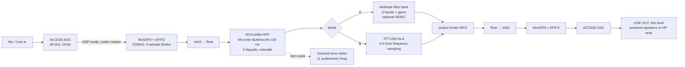
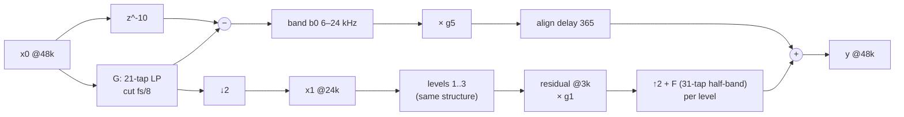

# 05 – System Design (Step 6)

**Labels:**

- **[Sx]**: from source x in `02_sources.md`.
- **DESIGN CHOICE**: our decision.
- **ASSUMPTION**: taken as true, not verified.
- **DEFAULT – confirm with team**: a decision the team should confirm.

**How the numbers were checked.** Every calculated number below was produced by `calc/design_check.py` (Python/SciPy, run on 3 Oct 2026; full output in `calc/design_check_output.txt`). The gain tables and the [S3] eq. (15)/(16) checks come from `calc/gain_check.py` (output in `calc/gain_check_output.txt`, re-run 3 Oct 2026 with the Bisgaard audiograms). This includes a full sample-by-sample simulation of the filter bank. MATLAB was not available, so re-running the same steps in MATLAB is the first job in `06_implementation_plan.md` §1.

---

## 1. Overview: one board, two processing modes

| Mode | What it is | Syllabus it carries |
|---|---|---|
| **Mode A – Multirate filter bank** (main hearing-aid path) | 4-level octave tree: split → ↓2 → … → per-band gain → ↑2 → recombine. 5 bands | Decimation, interpolation, linear-phase FIR by windowing, half-band filters, direct-form FIR, DSP architecture |
| **Mode B – FFT overlap-add equaliser** (comparison path) | The same gain curve, built as one 129-tap FIR by frequency sampling, run by FFT-256 fast convolution with overlap-add | DFT/IDFT, circular vs linear convolution, OLA (and OLS as a variant), radix-2/radix-4/mixed-radix FFT, frequency-sampling design |

Both modes share the same codec, DC-blocking IIR high-pass, output limiter and test tools (Goertzel).

- **Mode switching (DESIGN CHOICE).** Push button **S2 (GPIO2[4])** toggles Mode A/B. Button **S3 (GPIO2[5])** steps through the audiogram presets. **LED D4 (GPIO6[13])** shows the mode, D5 shows clipping and the preset (blink count), D6 is the CPU-busy scope pin [S11 Tables 7–8, p. 7]. D7 stays AMUTE (DECIDED). Buttons need no pin-mux; LED pin-mux values are PINMUX13[15:8] = 88h and PINMUX5[15:12] = 8h [TRM p. 247, 230]. A CCS variable remains as a fallback.
- **I/O framework (DECIDED in Update 5).**
  - **Fallback I/O modes (Update 6, DESIGN CHOICE):** stored input → LINE OUT, or fully internal (CCS graphs + cycle-count proof). Live audio stays the default (`06` §3.6).
  - **EDMA3 with the McASP Read FIFO ON (threshold 4 words) and the Write FIFO OFF.** EDMA events 0/1 [S8 Table 6-12] move data into 4-sample ping-pong blocks, with one EDMA completion interrupt per block. RX moves 4 words per event (FIFO pacing); TX one word per event, as in the S19 EDMA example (`research/hardware_notes.md` §1.4, §9).
  - Mode A processes each 4-sample block sample by sample in plain C. Mode B collects 128 samples in software and runs its FFT in the background loop.
  - Framing follows S19: codec master, DSP mode, McASP slave, burst. One 32-bit word carries L+R per sample (`research/hardware_notes.md` §1.4).
  - **Cost:** +10 samples (0.21 ms): **Mode A 8.81 ms, Mode B 7.67 ms** (§7). The Write FIFO was left off because it would add 64 words = 64 sample periods = 1.33 ms (one 32-bit word carries L+R).

**Why two modes.** The title names both. Comparing them on latency, CPU cycles and gain accuracy also gives the report its main result. Kates notes the same trade-off between filter-bank and FFT compressors [S7].

---

## 2. Block diagram

**Mode A detail (one level, repeated 4 times with the same coefficients):**

What happens at each level k:

- **Analysis.** The band b_k = x_k delayed by 10 samples − G·x_k. The next level gets x_{k+1} = ↓2(G·x_k).
- **Synthesis.** y_k = g_k · (b_k delayed) + ↑2-then-F(y_{k+1}).
- **Why the bands add back to the input.** The high band is "input minus lowpass", so the bands are complementary by construction. With all gains = 1 the output is the input, delayed (shown in §8).

---

## 3. Sampling rate

| Parameter | Value | Label |
|---|---|---|
| Codec rate fs | **48 kHz** | DEFAULT – confirm with team. AIC3106 supports 8–96 kHz [S13 p. 1]. 48 kHz comes from fS(ref) = PLLCLK_IN·K·R/(2048·P) or CLKDIV_IN/(128·Q) [S13 eqs. 1–2, p. 22–23; Table 10-1, p. 24]. 48 kHz is the default in the LCDK support code [S19]. On the LCDK, MCLK = **24.576 MHz** (oscillator Y5, net AIC_MCLK, S12 sheet 10), so 48 kHz = 24.576 MHz/(128 × 4) with the codec PLL off (our calculation; the same clock path is used by S19) |
| Why not 32 kHz like S2 | At 48 kHz, fs/8, fs/16, … land exactly on the audiometric crossovers 6 k, 3 k, 1.5 k and 750 Hz (half-octave audiometric frequencies listed in S1). We also skip S2's 48→32 kHz conversion | DESIGN CHOICE |
| Internal rates | 48, 24, 12, 6, 3 kHz | Result of DESIGN CHOICE (4 levels) |
| Word length | 16-bit codec samples, 32-bit float processing | DESIGN CHOICE (C674x has hardware SP/DP float [S8]) |

---

## 4. Bands and band edges

Each crossover is the −6 dB point of G at that level, i.e. f_c = fs_k / 8 (DESIGN CHOICE).

| Band | −6 dB edges | Audiometric centres covered | Processed at | Total decimation | Gain (from §6) |
|---|---|---|---|---|---|
| B5 | 6 kHz – 24 kHz | 8 kHz (6 k edge) | 48 kHz | 1 | 30.00 dB |
| B4 | 3 – 6 kHz | 4 kHz | 24 kHz | 2 | 30.00 dB |
| B3 | 1.5 – 3 kHz | 2 kHz | 12 kHz | 4 | 25.36 dB |
| B2 | 750 Hz – 1.5 kHz | 1 kHz | 6 kHz | 8 | 20.36 dB |
| B1 | 0 – 750 Hz | 250, 500 Hz | 3 kHz | 16 | 17.50 dB |

- **5 bands: DEFAULT – confirm with team.** S2 uses 11 half-octave bands [S2]; S1 uses 10 [S1]. We use fewer, wider bands to keep linear-phase latency under 10 ms (see §7). This is the same kind of spec relaxation discussed in [S3] (PDF5 §II-B: relax the ANSI S1.11 mask to meet a 10 ms delay).
- **Optional extra:** add a 5th level (crossover at 375 Hz) for 6 bands. Latency would rise to 31 × 25 / 48000 = 16.1 ms plus codec (calculation as in §7). Only worth it with minimum-phase filters (see §10).

---

## 5. Filters

All filters were designed with the window method (Kaiser window) as linear-phase FIRs (DESIGN CHOICE).

| Filter | Role | Length | Window | Spec | Achieved (calculated) |
|---|---|---|---|---|---|
| **G** | Band-split lowpass + anti-alias before ↓2 | **21 taps**, Type I, delay 10 samples | Kaiser β = 4.5 | cutoff fs_k/8; pass ≤ 0.05 fs_k; stop ≥ 0.20 fs_k | stopband **52.5 dB**, passband droop 0.00 dB |
| **F** | Anti-imaging after ↑2 (half-band) | **31 taps**, 17 non-zero (centre tap 0.500), delay 15 | Kaiser β = 4.5 | pass ≤ 0.20 fs_k, stop ≥ 0.30 fs_k | stopband **51.1 dB**, passband droop −0.014 dB |
| **HPF** | DC / rumble removal at input | 4th-order Butterworth, 100 Hz, bilinear (pre-warped) → 2 biquads | — | −3 dB at 100 Hz | biquad coefficients in `calc/design_check_output.txt` |
| **Mode B FIR** | Gain curve for OLA | **M = 129**, Type I, delay 64 | Frequency sampling | 65 samples H(k) at k·fs/129 = k × 372.1 Hz | max error vs N3 half-gain target **0.38 dB** (250 Hz–8 kHz) |

### Why those lengths (calculation)

The Kaiser length formula is N ≈ (A − 7.95) / (14.36 · Δf) + 1, where A is the stopband attenuation in dB and Δf is the transition width as a fraction of fs (textbook formula, see filter-design chapter [S21]).

- **G:** A = 50 dB, Δf = 0.20 − 0.05 = 0.15 → N ≈ 42.05 / 2.154 + 1 = **20.5 → 21**.
- **F:** Δf = 0.10 → N ≈ 30.3 → **31**. A half-band filter needs N = 4m − 1, and 31 fits (m = 8).

### Why the decimation does not alias

- After ↓2, input frequencies in [0.30, 0.50] fs_k fold onto [0, 0.20] fs_k, which is the region the next level uses.
- G is already ≥ 52.5 dB down from 0.20 fs_k upward, so those folded components are suppressed by at least 52 dB.
- Condition for this to hold: the stopband edge s must satisfy 0.5 − s ≥ s, i.e. s ≤ 0.25. We use s = 0.20 (DESIGN CHOICE with margin).

All coefficients are shared by all 4 levels: one G and one F array (DESIGN CHOICE; S2 also notes that multirate gives each band the same filter cost [S2]).

---

## 6. Gain table (Bisgaard standard audiograms)

The full derivation is in `research/audiogram.md`. It shows every value with its label: from Bisgaard Table 2/4, interpolated, or our calculation.

**Audiogram (DEFAULT – confirm with team).** Bisgaard **N3 (moderate)** [S26, Table 2]:

| Hz | 250 | 375 | 500 | 750 | 1 k | 1.5 k | 2 k | 3 k | 4 k | 6 k |
|---|---|---|---|---|---|---|---|---|---|---|
| HL, dB | 35 | 35 | 35 | 35 | 40 | 45 | 50 | 55 | 60 | 65 |

Test cases (named as in Bisgaard; "Bisgaard S2" is an audiogram, not source [S2]): **N2 (mild)** [S26, Table 2] and **Bisgaard S2 (steep sloping)** [S26, Table 4]. The table has no 8 kHz value, so we do not extrapolate.

**Rule.** Half-gain rule (Lybarger 1944, 1963, cited via Venema 2001 [S27]; original not read). Comparison: a "slightly less than half" variant (×0.4), illustrating NAL-R (Byrne & Dillon 1986, cited via [S27]; original not read). **The factor 0.4 is our choice, not the NAL-R formula.**

**30 dB cap:** DESIGN CHOICE, unchanged.

**Band mapping (our calculation).**

- B2, B3 and B4 take the HL at their geometric centres (1061, 2121 and 4243 Hz), interpolated on log-frequency.
- B1 takes the mean of the 250/375/500 Hz values.
- B5 takes the 6 kHz value.

| Band | N3 HL | **Gain used (N3, half, capped)** | N3 ×0.4 | N2 half | Bisgaard S2 half |
|---|---|---|---|---|---|
| B5 (> 6 k) | 65 (table) | **30.00** | 26.00 | 25.00 | 30.00 |
| B4 (3–6 k) | 60.73 (interp.) | **30.00** | 24.29 | 22.86 | 30.00 |
| B3 (1.5–3 k) | 50.73 (interp.) | **25.36** | 20.29 | 17.86 | 28.95 |
| B2 (0.75–1.5 k) | 40.73 (interp.) | **20.36** | 16.29 | 12.86 | 13.23 |
| B1 (< 750) | 35.00 (mean) | **17.50** | 14.00 | 10.00 | 10.00 |

**Simulated Mode A gain, N3 half-gain** (1 s tones; `calc/design_check_output.txt`, our calculation):

| Hz | 250 | 375 | 500 | 750 | 1 k | 1.5 k | 2 k | 3 k | 4 k | 6 k | 8 k |
|---|---|---|---|---|---|---|---|---|---|---|---|
| Gain, dB | 17.4 | 17.4 | 17.7 | 19.0 | 20.7 | 23.3 | 25.6 | 28.0 | 29.7 | 30.0 | 30.0 |
| Target, dB | 17.5 | 17.5 | 17.5 | 17.5 | 20.0 | 22.5 | 25.0 | 27.5 | 30.0 | 30.0 | 30.0 |
| Spurs/aliases, dBc | −69 | −67 | −67 | −68 | −67 | −67 | −69 | −70 | −68 | −85 | −76 |

The target is half of the HL interpolated at each frequency, capped. At 8 kHz the 6 kHz value is held.

- The maximum error is 1.53 dB (at 750 Hz, a crossover). This is within the 3 dB just-noticeable limit used in [S2] (PDF4 §IV).
- **Mode B** (372 Hz grid) follows the N3 curve within **0.38 dB** (our calculation).

**Limitation found: steep loss (Bisgaard S2).**

- Mode A misses the target by up to 6.82 dB at 1.5 kHz (×0.4 rule: 5.20 dB), because adjacent bands B2 and B3 differ by 15.7 dB.
- Mode B stays within 0.49 dB.
- **PROPOSED CHANGE – confirm (scope statement only, no structural change):** Mode A is for flat to moderately sloping losses; steep losses use Mode B. Details are in `research/audiogram.md` §4.

### Optional WDRC per band – OPTIONAL – confirm

This replaces the earlier one-pole sketch. The full method and its sources are in `research/literature_extracts.md` B4–B5.

| Item | Value | Label |
|---|---|---|
| Level detector | Rectified band signal, smoothed (Hilbert envelope as in [S2] PDF4 §III-B is a later upgrade) | DESIGN CHOICE |
| Gain loop | A[n+1] = A[n] + α·(R[n] − Y[n]) in dB, per band, at the band's own rate | [S4] PDF6 eq. (1); [S2] PDF4 eq. (1) |
| α_attack | 1 − (3/(A1 − A2 + 35))^(1/AT), with AT in samples at the band rate | [S4] PDF6 eq. (6) |
| α_release | 1 − (4/(A1 − A2 + 35))^(1/RT) | [S4] PDF6 eq. (7) |
| Compression ratio | 3:1 above the knee | Value tested in [S2] (PDF4 §IV); our choice to reuse it |
| Attack / release | 10 ms / 20 ms | Values tested in [S2] (PDF4 §IV) |
| Knee | −40 dBFS | DESIGN CHOICE |

**Example (our calculation).** Band at 6 kHz, CR 3:1:

- A1 − A2 + 35 = 35 − 35/3 = 23.33 dB.
- α_attack = 1 − (3/23.33)^(1/60) = 0.0336.
- α_release = 1 − (4/23.33)^(1/120) = 0.0146.

**Cost** is about 6 ops per band sample, i.e. under 1 % CPU (our estimate). **Build it only after the core passes T2–T5.**

---

## 7. Latency (calculated)

### Mode A: filter-bank delay

The path delay at level k, counted in samples at that level's own rate, is:

T_k = (N_G − 1)/2 + (N_F − 1)/2 + 2·T_{k+1} = 10 + 15 + 2·T_{k+1},  with T_4 = 0

- T_3 = 25, T_2 = 75, T_1 = 175, T_0 = **375 samples at 48 kHz = 7.81 ms**.
- Closed form: T_0 = 25·(2⁴ − 1).
- The simulation confirms it: the output impulse peaks at n = 375.

Delay added by each stage:

| Level | 0 (48 k) | 1 (24 k) | 2 (12 k) | 3 (6 k) |
|---|---|---|---|---|
| Stage delay | 0.52 ms | 1.04 ms | 2.08 ms | 4.17 ms |

The lowest level costs the most because low-frequency resolution needs time.

### Codec delay [S13]

ADC 17/fs + DAC 21/fs = 38/48000 = **0.79 ms**.

### End-to-end totals

| Configuration | Calculation | Total |
|---|---|---|
| Mode A, FIFO off, per-sample interrupt (Update 3 default) | 7.81 + 0.79 | 8.60 ms |
| **Mode A, Read FIFO on + EDMA 4-sample blocks, Write FIFO off (DEFAULT)** | (375 + 10)/48000 + 0.79 | **8.81 ms** |
| Mode A, Read + Write FIFO on (Update 4, rejected) | (375 + 74)/48000 + 0.79 | 10.15 ms (over target) |
| Mode A, 16-sample ping-pong frames (+2 frames) | (375 + 32)/48000 + 0.79 | 9.27 ms |
| Mode A, 32-sample frames | (375 + 64)/48000 + 0.79 | 9.94 ms |
| Mode B, FIFO off | (2L + (M − 1)/2)/fs + codec = (256 + 64)/48000 + 0.79 | 7.46 ms |
| **Mode B, Read FIFO only (DEFAULT)** | (320 + 10)/48000 + 0.79 | **7.67 ms** |
| Mode B, Read + Write FIFO (rejected) | (320 + 74)/48000 + 0.79 | 9.00 ms |

- **Mode B model: ASSUMPTION.** We take the worst case of one block filling + one block being played out (2L), plus the FIR group delay. Measure it (`07_testing_plan.md` T5).
- **Target ≤ 10 ms:** the 10 ms threshold is given in S1 and S6. With the default (Read FIFO on, Write FIFO off) **both modes meet it: 8.81 / 7.67 ms**.
- **McASP audio FIFO (Update 5 default):** Read FIFO on (4 words), Write FIFO off. The extra 10 samples are: Read FIFO ≤ 4 (= one 4-sample block fill) + one block of processing + ≈ 2 in XBUF/shift (ASSUMPTION). The Write FIFO would add 64 words ("attempts to stay filled", S14 p. 52; 256 bytes = 64 words, S14 p. 12). Because S19 packs L+R into one 32-bit word (one slot per frame), 64 words = 64 sample periods = **1.33 ms**, not the 0.67 ms that 2-words-per-frame I2S would give. Source: `calc/latency_check.py`.
- **For comparison:** S2 reports 32 ms (linear phase, 11 bands) and 5.4 ms (minimum phase) [S2]. S5 reports 7.98 ms [S5].

---

## 8. Reconstruction check (calculated)

With all gains = 1, Mode A output = input delayed by 375 samples.

| Check | Result |
|---|---|
| Composite ripple, 50 Hz–20 kHz | +0.020 / −0.010 dB |
| Reconstruction error energy | −63.1 dB relative to the impulse |
| Isolation between bands (leakage of one band outside its range) | about −43 dB or lower (see `calc/fig_modeA_bands.png`). We accept this instead of S2's −75 dB (DESIGN CHOICE, relaxed spec as in [S3]) |
| Against ANSI S1.11 class 2 ([S3] PDF5 §II-A) | Summed ripple +0.020/−0.010 dB vs the ±0.5 dB limit: **passes**. G/F stopband 52.5/51.1 dB vs > 60 dB: **does not meet it**. Reaching 60 dB needs G = 27 and F = 39 taps, which pushes latency to 10.79 ms with the codec (our calculation, `calc/gain_check_output.txt`). We keep 52 dB. The full 19-point ANSI mask was not checked |
| Gain equalisation ([S3] eq. 17) | **Not needed.** The bands are complementary, so the unity-gain sum is already flat. See `research/literature_extracts.md` A5 |

---

## 9. CPU and MAC count on C6748 (calculated)

**Clock:** 456 MHz is the device maximum [S8 p. 1] and is listed in the LCDK features [S11 §1.1]. TI's NAND-boot AISgen configuration runs the CPU at 300 MHz [S11 §3.5]. The clock after the CCS GEL script must be read on the board, so both clocks are used below.

### Mode A operation count (per sample at level k)

| Item | Ops |
|---|---|
| G (direct form) | 21 MAC |
| F (polyphase half-band: 17 non-zero taps per 2 outputs) | 8.5 MAC |
| Gain multiply + 2 add/subtract | 3 |
| **Total per level sample** | **32.5 ops** |

Sample rates summed over the 4 levels: 48 + 24 + 12 + 6 = 90 k samples/s. Adding the residual gain at 3 kHz gives:

- **2.93 M ops/s = 61 ops per input sample.** This is a conservative count (adds included, symmetry ignored).
- **Cross-check with [S3] eq. (16)** (PDF5 p. 1386; multiplies only, symmetric FIRs): 50.62 multiplies per sample with G and F as full symmetric FIRs; 31.00 with half-band zeros, polyphase F and the gain multiplies (our calculation, `calc/gain_check_output.txt`). The 61-op figure is kept for the CPU estimates, as a safety margin.
- **Cross-check with [S3] eq. (15)** (delay): the B1 path is 10·(1+2+4+8) + 15·(1+2+4+8) = 375 samples, the same as §7.
- Single-rate equivalent (each split filter at 48 kHz with the same transition width in Hz: lengths 21, 41, 81, 161): **313 ops/sample**.
- Multirate saving: **5.1×**. S1 reported 9.1× and S2 13.7× for 10 or 11 bands with longer filters [S1][S2].

### CPU load (re-checked against the TI documents in Update 3)

Source: `calc/cpu_check.py` → `calc/cpu_check_output.txt`. Function constraints come from [S15]; see `research/hardware_notes.md` §3–4.

**Correction.** The earlier 16-sample-frame estimate (1934 cycles, "1.27 %") called `DSPF_sp_fir_gen` with nr = 2 and `DSPF_sp_biquad` with nx = 16. Both break the DSPLIB rules: fir_gen needs nr ≥ 4 [S15 p. 4-41], and biquad needs nx to be a multiple of 3 [S15 p. 4-46]. The estimate is replaced below.

| Case | Cycles | Load @ 456 MHz | Load @ 300 MHz |
|---|---|---|---|
| **Mode A, EDMA + AFIFO, 4-sample blocks (DEFAULT, Update 4)** | 83 ops/sample × 1–5 cycles/op + block ISR 300–900 cycles per 4 samples (ASSUMPTIONS) | **1.7 – 6.7 %** | 2.5 – 10.2 % |
| Mode A, per-sample ISR, plain C (Update 3) | 83 ops/sample × 1–5 cycles/op + 200–600 cycles ISR per sample | 3.0 – 10.7 % | 4.5 – 16.2 % |
| Mode A, 32-sample EDMA frames (option; fir_gen valid at nr = 32/16/8/4) | 3874 per 32 samples | 1.27 % | 1.94 % |
| Mode B, FFT work per 128-sample frame | 2923 (fftSPxSP) + 2923 (ifftSPxSP) [S15 p. 4-25, 4-33] + 1024 (complex multiply) + 512 (conversion) + 256 (OLA) + 4608 (HPF) + 500 overhead = 12,746 | 1.05 % (2.10 % with the 2× cache margin seen in S16 Table 7) | 1.59 % (3.19 %) |
| **Mode B, FFT work with the C674x DSPLIB (Update 6 library)** | 1965 (fftSPxSP) + 1985 (ifftSPxSP) [C674x TestReport] + same 6900 for the rest = **10,850 cycles/frame** | — | — |
| **Mode B, EDMA + Read FIFO, C674x DSPLIB (DEFAULT)** | 10,850/frame + block ISR 300–900 per 4 samples | **1.7 – 3.3 %** | 2.6 – 5.0 % |
| Mode B inside a per-sample ISR (Update 3) | frame work + 200–600 ISR cycles/sample | 3.2 – 7.4 % | 4.8 – 11.2 % |

Per-sample budget: 456 MHz / 48 kHz = 9500 cycles (6250 at 300 MHz). **Worst case with the default I/O ≈ 10 % CPU (16 % for the old per-sample scheme), so the design fits.**

**FFT algorithm comparison at N = 256** (formulas [S15]; N = 256 = 4⁴, so radix-4 applies):

| Function | Cycles |
|---|---|
| `DSPF_sp_cfftr2_dit` (radix-2 DIT) | 4138 |
| + `DSPF_sp_bitrev_cplx` (bit reversal) | 666 |
| `DSPF_sp_cfftr4_dif` (radix-4 DIF) | 3696 |
| `DSPF_sp_fftSPxSP` (mixed radix) | 2923 |

Radix-2 forward + inverse can skip bit reversal: `cfftr2_dit` outputs bit-reversed data and `icfftr2_dif` takes bit-reversed input [S15 p. 4-13, 4-34]. Total 4138 + 4133 = 8271 cycles (comparison experiment).

**Conclusion:** both modes use about 2–7 % of the CPU at 456 MHz (up to 10 % at 300 MHz) with the default EDMA + FIFO I/O. Latency, not CPU, is the binding constraint. The spare CPU leaves room for WDRC, more bands or noise reduction (extras).

---

## 10. Optional extras (only after the basic version works)

1. **Per-band WDRC** (§6, OPTIONAL – confirm). Adds about 6 ops per band sample.
2. **Minimum-phase G and F** (as in S2 [S2], PDF4 §II-E: 32 → 5.4 ms for their 11-band bank). Reflect zeros that lie outside the unit circle to the inside. This roughly halves the delay but the phase is no longer linear, so the bands may not sum flat; re-check §8. [S3] (PDF5 §I) warns that phase distortion harms harmonic and binaural cues.
3. **11 half-octave bands as in S2.**
4. **Rational 48 → 32 kHz conversion (I/D = 2/3) as in S2**, so the processing matches S2's rates.
5. **Overlap-save version of Mode B** (same FFT size; discard the first M − 1 = 128 outputs of every 256).
6. **Spectral-subtraction noise reduction in Mode B.** Not in our sources; research needed.

---

## 11. Summary of key numbers

| Quantity | Value | Label |
|---|---|---|
| fs | 48 kHz | DEFAULT – confirm |
| Bands | 5 (crossovers 750 / 1.5 k / 3 k / 6 kHz) | DEFAULT – confirm |
| Decimation factors | 1, 2, 4, 8, 16 | DESIGN CHOICE |
| G / F | 21-tap Kaiser LP / 31-tap half-band | DESIGN CHOICE, calculated |
| Mode A latency | **8.81 ms** (default: Read FIFO on, Write FIFO off); 8.60 ms FIFO off | Calculated, `calc/latency_check.py` |
| Mode B: M / L / N | 129 / 128 / 256 | DESIGN CHOICE |
| Mode B latency | **7.67 ms** (default); 7.46 ms FIFO off | Calculated (ASSUMPTION on buffering model) |
| Mode A load | 1.7–6.7 % @ 456 MHz (2.5–10.2 % @ 300 MHz) | Calculated, `calc/cpu_check.py` (stated assumptions) |
| Mode B load | 1.7–3.3 % @ 456 MHz (2.6–5.0 % @ 300 MHz) with the C674x DSPLIB | Calculated, `calc/cpu_check.py` (Update 6) |
| I/O | EDMA3 + McASP Read FIFO (RNUMEVT = 4), Write FIFO off, 4-sample blocks; codec master, DSP mode 16-bit, McASP slave burst (S19 framing); I2C0 at 0x18; AXR13 TX, AXR14 RX | DECIDED (Update 5); wiring from S12 sheet 10; register values checked against the S19 package |
| Mode/preset controls | S2 = GPIO2[4] mode, S3 = GPIO2[5] audiogram, LED D4 = mode [S11] | DESIGN CHOICE |
| Multirate saving | 5.1× | Calculated |
| Audiogram / rule | Bisgaard N3 [S26 T2], half-gain [S27], 30 dB cap | DEFAULT – confirm |
| Band gains B5…B1 | 30.00 / 30.00 / 25.36 / 20.36 / 17.50 dB | Our calculation (`research/audiogram.md`) |
| Gain error, N3 | Mode A 1.53 dB, Mode B 0.38 dB | Calculated |
| Gain error, steep Bisgaard S2 | Mode A 6.82 dB, Mode B 0.49 dB | Calculated: limitation, see §6 |
| WDRC | Per-band AGC, [S4] eqs. (1), (6), (7) | OPTIONAL – confirm |
